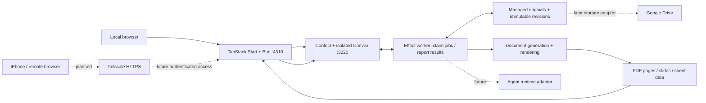

# HA Workspace — architecture and delivery plan

Status: connected local prototype, updated September 8, 2026. The authenticated catalog, Confect/Atom subscriptions, previews, file/source metadata, downloads, versioned comments, and bounded exact-text revision jobs are implemented. Doppler injection and the configured production build pass. Source checks, backend tests, browser checks, and real-document verification establish different parts of the result; see `SETUP.md` for their scope. AI execution, generated reports/invoices, full Office editing, and remote access remain future work.

Based on the **HA Workflow App Wireframe** task (`01a07ea0-e62b-7351-9374-828b3122a949`) and its final local HTML prototype. Use the wireframe to understand the work: find a file, review it, request a correction, and inspect the next revision. The adopted interface uses Vercel-inspired neutral dark surfaces, self-hosted Geist Sans/Mono, Base UI through shadcn `base-nova`, and Hugeicons. T3-style sidebar behavior and accessible motion remain part of the workflow. `DESIGN.md` is the current design authority.

## Recommended direction

Build a personal, browser-based workspace using **shadcn + TanStack Start + Tailwind**, **Vite+**, **Convex**, and **Effect v4 RC with Confect v10 prerelease**. Use a small Bun workspace monorepo because the application needs both a browser/server app and a local document worker. Adopt a **hexagonal modular monolith organized by feature**: domain rules and Effect use cases at the center, with Convex, Bun, React, file tools, and the agent runtime connected through explicit adapters.

The user chose local hosting. Inspection of the existing `/home/akh/LocalServices/Convex` service led to an isolated HA instance: native Convex `ha-workspace-local` on `3220`/`3221`, with data under `/home/akh/Projects/ha-workspace-data/convex`. The existing service on `3210` was preserved. The Bun app serves loopback `4310`; development uses a separate API listener on `4312`. Tailscale and remote iPhone access remain deployment gates.



Arrows show logical responsibilities. File bytes go through authenticated upload/download endpoints; Convex records hold references and hashes. The browser receives no filesystem paths or worker/admin credentials.

## Current product slice

The app reads a standalone copy of the consulting and inspection collections. Company/project groupings come from folder evidence, with ambiguous context kept explicit. The four document categories share file rows, filters, search, and the version workspace. Agents is a separate read-only resource library. Catalog queries cap returned matches and tell the view when to narrow a search.

PDF and image previews use protected local content URLs. Word and PowerPoint convert locally to PDF; workbooks expose bounded read-only grids; text is displayed without executing markup. The Context inspector contains file/source metadata and labeled folder inference. Extracted document text is no longer an inspector feature; backend extraction supports preview and worker validation. Comments remain attached to their source revision; important drafts persist through an Effect IndexedDB adapter.

The first revision operation is deliberately precise: replace one exact match in DOCX, TXT, or Markdown. DOCX edits support uninterrupted body text; headers, fields, tracked changes, and cross-paragraph edits require another workflow. The worker preserves source bytes, validates the candidate, renders Word output, and commits a new immutable version through the durable queue. It does not infer changes from comments or generate new reports.

## Target product boundaries

The table below retains the broader product requirements. Page/rectangle/cell annotation, intake, new-document creation, and instruction editing are future features; they are not implied by the connected preview and exact-text revision slice.

| Surface        | Required behavior                                                                                       |
| -------------- | ------------------------------------------------------------------------------------------------------- |
| Companies      | Company list → selected company → its files → shared preview workspace                                  |
| Reports        | Recent reports and counts by company; filters return reports only                                       |
| Invoices       | Invoice-only list and preview; payment status is explicit data, never inferred from a filename          |
| Templates      | Global and company/project templates, scope/default badges, file previews                               |
| File workspace | Version selector, preview, annotations, comments, context, change request, refreshed revision           |
| Agents library | Copied skills, guidance, tools and references; source/preview viewing, search and related resources     |
| Agent editor   | Future instruction editing, revision comparison, save/apply states and runtime activation               |
| Intake         | Reuse known facts; ask one batch of missing material questions; preserve answers and scoped corrections |

The connected preview path covers DOCX, XLSX, PDF, PPTX, supported images, and text. Legacy DOC/XLS/PPT require a separately tested conversion path. Office files remain downloadable originals. Current revisions use explicit find/replacement text. Page annotations and structured field edits remain planned; arbitrary Word/Excel/PowerPoint editing is a separate capability decision.

See `EFFECT_GUIDE.md` for the adopted dependency rules, Effect v4 coding standard, transaction invariants, and acceptance tests. The visual plan includes these requirements in its engineering notes.

## Verified stack and version policy

Registry values were checked directly during this planning session. These pins are installed and have passed the configured build. Bun 1.4.2 is the latest stable release verified on September 8, 2026. Bun 1.4.2 and Node 24.20.0 are now installed and pinned in the repository’s `mise.toml`. The remaining rows record the researched baseline used by the connected application.

| Package/tool          | Pin                            | Planning consequence                                                                  |
| --------------------- | ------------------------------ | ------------------------------------------------------------------------------------- |
| Bun                   | 1.4.2 stable                   | Workspace package manager and target runtime for the web server and Effect worker     |
| Node tooling          | 24.20.0, pinned in `mise.toml` | Vite+ and Confect toolchain compatibility; not the application worker runtime         |
| Vite+                 | 0.3.0                          | Unified dev/build/check/test and workspace task runner                                |
| TanStack Start        | 1.168.50                       | React routing and server shell; preserve scaffold-compatible Router/React versions    |
| shadcn CLI            | 4.21.0                         | Begin with its TanStack Start monorepo template                                       |
| Tailwind CSS          | 4.3.3                          | Shared semantic tokens in the UI package                                              |
| Convex                | 1.45.0                         | Satisfies the inspected Confect server peer requirement                               |
| Effect                | 4.0.0-rc.112                   | Explicit RC pin; `latest` still resolves to v3                                        |
| @effect/atom-react    | 4.0.0-rc.112                   | Effect-native UI state and commands; React 19 and scheduler >=0.25.0 <0.28.0 required |
| @effect/vitest        | 4.0.0-rc.112                   | Effect scopes and test services within Vite+ Vitest                                   |
| Confect packages      | 10.0.0-next.21                 | Explicit prerelease pins; stable v9 targets Effect v3                                 |
| @effect/platform-bun  | 4.0.0-rc.112                   | Bun services and worker entry point                                                   |
| @effect/platform-node | 4.0.0-rc.112                   | Confect server/CLI dependency and tooling boundary                                    |

Use scoped `@confect/*` packages; the unrelated bare `confect` npm package is not the framework. Pin all selected Confect packages to the same version. Use core/server/cli/js/test initially; the inspected React package is an alternative client, not an additional subscription layer. Registry metadata for the [Effect RC](https://registry.npmjs.org/effect/4.0.0-rc.112) and [Confect server prerelease](https://registry.npmjs.org/@confect/server/10.0.0-next.21) establishes this compatibility target. See `dependency-evidence.json` for the captured package metadata.

### Scaffold and tooling

The repository began with the official shadcn TanStack Start monorepo flow. Keep its app/UI package arrangement and the established Bun/Vite+ orchestration. The selected primitive base is now Base UI, recorded as `base-nova` in both `components.json` files, with neutral CSS variables and `hugeicons` as the icon library. Geist variable font assets are bundled locally. Do not scaffold over the connected application to apply a visual preset. [shadcn installation](https://ui.shadcn.com/docs/installation/tanstack), [monorepo guide](https://ui.shadcn.com/docs/monorepo), [Base UI support](https://ui.shadcn.com/docs/changelog/2026-01-base-ui).

Run Vite+ migration from the new repository root. Meet its Vite 8+/Vitest 4.1+ migration prerequisites first; inspect aliases and plugin compatibility rather than assuming the scaffold already meets them. Preserve TanStack Start, React, and Tailwind Vite plugins and their documented ordering. Vite+ migration also manages the Vite alias and matching Vitest version. [Migration](https://viteplus.dev/guide/migrate).

Use Oxlint and Oxfmt through `vp check`, with type-aware linting and type checking enabled. Use `vp test` for domain/backend tests and Playwright for the critical browser flow. Use `vp run` for workspace tasks and codegen ordering; avoid maintaining two task runners. Check any framework-specific ESLint rules for migration gaps before removal; retain narrowly scoped checks only if needed. [Static checks](https://viteplus.dev/guide/check), [task runner](https://viteplus.dev/guide/run).

### Bun and Vite+ have different jobs

Use **Bun 1.4.2 stable**, which includes the Rust rewrite introduced in Bun 1.4. This choice changes the JavaScript runtime and package manager; application code remains TypeScript. Bun’s 1.4.2 notes include an AsyncLocalStorage leak fix and long-running JIT/GC fixes, which are relevant to a persistent agent/document worker. Actual performance and reliability still need our workload tests. [Bun 1.4](https://bun.com/blog/bun-v1.4), [Bun 1.4.2](https://bun.com/blog/bun-v1.4.2).

Declare `"packageManager": "bun@1.4.2"`, use root `package.json` workspaces/catalogs and `workspace:*` internal dependencies, and commit one `bun.lock`. CI installs with a frozen lockfile. Once the generated starter is converted, remove its obsolete pnpm lock/config and Turbo scripts. Vite+ explicitly supports Bun package management and detects the package manager from the root declaration. [Bun workspaces](https://bun.com/docs/pm/workspaces), [Vite+ package management](https://viteplus.dev/guide/install).

| Responsibility                                         | Tool/runtime                                                                                 |
| ------------------------------------------------------ | -------------------------------------------------------------------------------------------- |
| Dependency installation                                | Bun, directly or through Vite+ forwarding                                                    |
| Lint, format, type checks, build, workspace task graph | Vite+                                                                                        |
| Main unit/integration tests                            | Vite+ Vitest with matching `@effect/vitest`; no duplicate suite in Bun’s test runner         |
| Worker process                                         | Bun + matching `@effect/platform-bun`                                                        |
| Production Start server                                | Bun, using the supported Start server adapter/build target verified in the first slice       |
| Vite+/Confect CLI and code generation                  | Compatible Node toolchain until explicit Bun execution passes a supported compatibility test |
| Convex queries/mutations                               | Convex’s own deterministic runtime                                                           |
| Convex Node actions, if needed                         | Runtime supplied by the local Convex backend; inspect its version separately                 |

The configured Start production output has been built and served on Bun. Keep checking that production entry point when updating the toolchain; a successful development server alone does not establish it. Vite+ manages Node separately; Bun package management does not switch every CLI’s execution runtime. Keep Node dependencies at that tooling boundary. [Bun Start guide](https://bun.com/guides/ecosystem/tanstack-start), [Vite+ environment](https://viteplus.dev/guide/env).

Start Bun worker code through the Effect Bun runtime entry point. Keep `Bun.*`, raw `fetch`, process spawning and filesystem APIs inside adapters; prefer Effect platform services there. Use Vite+ for the existing test/build responsibilities instead of adding a second runner or bundler. Pin stable Bun upgrades deliberately and re-run the runtime checks before changing the lockfile.

### Repository layout

```text
ha-workspace/
  apps/
    web/                    # shadcn TanStack Start app
      src/routes/
      src/features/workspace/ # catalog, previews, drafts, comments, revisions
    worker/                 # Effect Bun import, revision queue, dev process runner
  packages/
    ui/                     # generated shadcn components + HA shell + tokens
    domain/                 # Effect schemas, facts, pure policies, revision contracts
    application/            # Effect use cases and ports, grouped by feature
    backend/
      confect/tables/        # table definitions
      confect/*.spec.ts      # client-safe API contracts
      confect/*.impl.ts      # backend implementations
      confect/_generated/    # generated
      convex/               # Confect deploy output/config
    documents/              # format adapters and calls to retained render tools
  docs/                     # architecture, design, decisions, operating notes
  package.json              # packageManager: bun@1.4.2 and explicit workspaces
  bun.lock
  bunfig.toml
  vite.config.ts
```

The private repository is `https://github.com/alexmikeagent/ha-workspace`, checked out at `/home/akh/Projects/ha-workspace`. It sits outside the Google Drive sync tree. Keep source documents, databases, temporary renderer profiles, and job staging outside Git. The adjacent `/home/akh/Projects/ha-workspace-data` directory owns the prototype’s local Drive data.

Domain imports Effect and its own modules. Application imports domain and declares ports with Context.Service. Backend and runtime adapters implement those ports. The web and worker entry points compose Layers. Backend functions never import document renderers, and browser exports cannot reach server implementation code. Keep every workspace dependency explicit.

Confect expects sibling `confect/` and `convex/` directories and generates deployment files and client refs. Treat generated files as output; configure the backend workspace as the codegen/deployment working directory. Tests should use `.test.ts` so Confect API `.spec.ts` files are not mistaken for tests. [Confect v10 structure](https://confect.dev/v10/concepts/project-structure).

## Repository and configuration decisions

Work from `/home/akh/Projects/ha-workspace` with the private GitHub remote [alexmikeagent/ha-workspace](https://github.com/alexmikeagent/ha-workspace). Use small, coherent commits with a passing check at each meaningful boundary. Keep the main branch runnable; use focused branches for substantial feature work. Review the final diff, test behavior that can regress, and update operating notes when configuration or migrations change. Generated backend code and lockfiles follow one documented regeneration path. Private Drive documents and secret values are never repository fixtures.

All application environment values and secrets belong to the new **Doppler `ha-workspace` project**, in workplace **OmarchySys76**, using **`dev_personal`** for this local environment. Runtime commands receive configuration through `doppler run --no-fallback`; do not create app `.env` files or export secret-value snapshots. Repository files may declare variable names, validation schemas, and non-secret project/config references. Doppler CLI authentication and runtime injection have been verified; the app, worker, deployment, and import commands use this configuration.

Load injected values with Effect `Config` at each composition root, use redacted secret values, and fail startup with a safe explanation if required configuration is missing. Map only intentionally public configuration to the browser. Deployment/admin keys, service tokens, local filesystem roots, and renderer credentials stay on server/worker boundaries. CI should use its own identity/config; personal CLI credentials must not be reused as CI secrets. Authenticate and test the runtime injection before starting app processes.

## Data and state ownership

The current Confect `workspace` API implements catalog, file details, versioned comments, revision requests, claims, status checks, completion, failure, and cancellation. Its deployed tables cover company/project/file/version metadata, comments, revision jobs, and import state. The richer schema below is the target model for intake and generation; tables such as instruction versions and template bindings are not implemented yet.

Convex owns durable application state and transaction boundaries. Effect owns typed domain operations, dependency injection, error handling, cancellation, and worker orchestration. An Effect program is not by itself a durable queue.

Use Effect Atom as the UI state layer: `@effect/atom-react` with the v4 reactivity modules. One session-owned registry owns feature atoms and their runtimes for derived values, typed commands, and stream-backed reads. Use one scoped `@confect/js` WebSocket client for live queries and commands; an adapter preserves its schema codecs and typed query results. Do not add parallel Confect React subscriptions or a second query cache. [Effect React bindings](https://github.com/Effect-TS/effect/blob/effect%404.0.0-rc.112/packages/atom/react/README.md), [Confect JS client](https://confect.dev/v10/clients/js/websocket.md).

TanStack Router owns navigation and URL filters. Atoms own shared workspace state, panel preferences, draft editing, annotation selection, and command status; React handles local DOM details. Persist drafts through an Effect storage adapter, keyed by owner and immutable source revision. Start with an SSR shell and client-loaded authenticated atoms. Any later data hydration uses request-owned registries and an explicit serialization boundary. `EFFECT_GUIDE.md` defines the ownership and lifecycle checks.

| Tables                                | Purpose and key relationships                                                                             |
| ------------------------------------- | --------------------------------------------------------------------------------------------------------- |
| users, companies, projects            | Single owner initially; projects belong to a company                                                      |
| files                                 | Logical file; company/project, category, MIME type, latest ready revision                                 |
| fileVersions                          | Immutable bytes reference, parent, SHA-256, size, provenance and validation state                         |
| previews                              | Source version/hash, renderer version, page/slide/sheet manifest, status                                  |
| templates, templateBindings           | Versioned template and scope; bindings by task kind, company/project and effective dates                  |
| tasks, contextSnapshots               | Operation kind, structured facts with sources, missing fields, chosen input/template/instruction versions |
| comments                              | File version, anchor, message, status and linked revision request                                         |
| jobs, jobEvents                       | Durable work, attempt/lease, progress, cancellation and structured failure                                |
| instructionFiles, instructionVersions | AGENTS.md/skills source, hash, draft and active version                                                   |

Index lists by owner/company/category and date, file versions by file, comments by version, and jobs by state/lease. Paginate lists and event history. Store date-only visit dates separately from UTC event timestamps. Represent money in integer minor units and keep rate evidence scoped to the client.

As intake and generation expand, split the current `workspace` API into focused groups: `companies`, `files`, `templates`, `tasks`, `comments`, `jobs`, and `instructions`. File commands create an upload reservation, finalize a verified version, and return an authenticated preview/download reference. `tasks.prepare` reports missing fields; `tasks.start` records a context snapshot and enqueues work atomically. A revision request includes its base version and idempotency key.

## Document and review pipeline

The current import → preview → comment → exact-text revision path implements a bounded part of this pipeline. Template selection, fact intake, full generation, rich annotation, and a separate final-publication command remain future capabilities.

1. Import or upload a source into managed storage. Verify extension/MIME, hash it, and record the selected company, project, and category.
2. Resolve the task operation: new completed document, intentionally incomplete draft, limited copy, or revision. Ask only the questions material to that operation.
3. Resolve an authorized template and effective client facts. Record source references and a frozen context snapshot.
4. Atomically create a queued job. The local worker claims it through an authenticated mutation using a lease and attempt/fencing token.
5. Work in a job-owned directory. Generate a uniquely named candidate using deterministic tools wrapped by Effect.
6. Run DOCX compatibility checks before rendering. Produce a preview manifest and perform the relevant content/layout verification.
7. Commit an immutable ready revision and its preview together at the metadata boundary. Failed or stale attempts cannot replace the visible version.
8. Realtime updates refresh the preview while retaining the user's navigation, comments, and composer draft. Publication creates a new final filename under the applicable workflow policy.

Use heartbeats, lease expiry, bounded retries for transient failures, and explicit cancel requests. Recheck cancellation, base revision, running state, lease expiry, and fencing token before commit. Scope idempotency keys by owner and operation and bind them to a canonical request fingerprint; a reused key with changed payload is a typed conflict.

Render attempts only stage bytes and commit ready revisions. A separate publication command freezes an already committed revision ID/hash, canonical new destination, and operation ID. Publish with exclusive creation and no replacement, rechecking Word locks. A replay accepts an existing matching hash; conflicting bytes produce `PublicationConflict`. This supports recovery after a file write without allowing a stale render attempt to publish its candidate. Operations must tolerate repeated attempts.

Convex queries/mutations stay deterministic and do no filesystem/process I/O. Even self-hosted Convex has its own function runtime; its functions do not run in the document worker’s Bun process. Conversion and long-running agent sessions run in the worker. [Convex runtimes](https://docs.convex.dev/functions/runtimes).

### Preview contract

| Format       | Connected behavior                                                                   | Remaining work                                                        |
| ------------ | ------------------------------------------------------------------------------------ | --------------------------------------------------------------------- |
| DOCX         | Verified local conversion to PDF; source download; bounded exact-text body revisions | Template-field editing, page annotations, wider fidelity checks       |
| PDF          | Browser PDF viewer served from an authenticated endpoint                             | PDF.js text/region anchors and page virtualization                    |
| PPTX         | Local conversion to PDF                                                              | Slide thumbnails, slide-aware comments, editing                       |
| XLSX         | Bounded read-only sheet grid                                                         | Cell anchors, richer formatting, independently verified recalculation |
| Images       | Protected image preview with fit/zoom controls                                       | Region annotations and richer photo context                           |
| TXT/Markdown | Plain readable text, source download, exact-text revisions                           | Editor, line anchors, sanitized rich Markdown view                    |

Preview metadata and bytes remain bound to the selected file/version ID. Unsupported formats stay downloadable. Workbook grids and plain-text previews are bounded views, not proof of recalculation or Office layout fidelity. Macro and external-resource validation runs before local Office conversion.

Derived previews are stored outside Git under the private data root, keyed by source hash and the renderer version. Future annotation anchors must stay with their original revision when layout changes; never silently move a comment to a new paragraph or cell.

### HA invariants to enforce in code

The existing project AGENTS.md supplies the authority: immutable general report/invoice templates, exact Dulles exceptions, same-client evidence for billing, namespace compatibility checks, Word owner-file locks, new filenames for publication, and job-directory ownership. Preserve template hashes in the database; a generic scope resolver cannot override an explicit exception. Conflicting or missing material authority becomes one targeted intake question.

Wrap the retained document tools before replacing them. On Windows use the specified safe renderer and its process-isolation behavior. Fail DOCX validation for undeclared Markup Compatibility namespaces. Rendering results do not authorize rewriting the source template to compensate for renderer differences.

## Read-only Agents library

`/?section=agents` opens the copied project library; `resource` selects a resource by opaque ID. The current checkpoint contains 29 resources: 3 skills, 2 guidance files, 11 references, 8 tools, and 5 configuration files. Sixteen missing support files were copied additively and verified by hash; the three existing `SKILL.md` files were preserved. These resources stay outside Git, alongside the other private working-copy data.

The authenticated `GET /api/agents` and `GET /api/agents/:id` endpoints use the existing local owner session. `AgentLibraryStore` is an Effect service in the documents adapter, with shared schemas in the domain package. Browser reads use an independent `Atom.runtime(Layer.empty)` inside the existing app registry. Each list or detail request first calls `readSession`, then makes the authenticated HTTP request and decodes its response. This filesystem-backed library does not depend on the Confect connection layer, so a Convex startup failure need not block it. A focused retry test verifies that Refresh recovers after a transient owner-session failure without opening a WebSocket. The library does not add Convex tables, subscriptions, or deployment changes.

Discovery covers fixed approved guidance, the template manifest, local tools, and valid skill directories under `.agents/skills`. A skill exposes its `SKILL.md`, agent configuration, references, scripts, and supported text assets. Refresh rescans these locations; a newly copied allowed skill can appear without editing a hardcoded card list. The scan is bounded to 128 resources, 256 entries per directory, and six nested levels; source previews are capped at 256 KiB. It rejects out-of-root paths and symlinks, excludes task-owned `.codex-*` directories, and filters hidden, operational, and credential-like names. Binary or invalid UTF-8 resources are not rendered as text.

The UI provides search, kind filters, skill cards, linked supporting resources, and Source/Preview viewing with metadata in the existing resizable inspector. Source uses line numbers and lazy Shiki syntax tokens for recognized formats, with a readable plain-text fallback for unknown types, oversized content, or highlighting failure. The scoped highlighter is shared within the registry and released with it. Its production chunk is about 803 KB raw / 128 KB gzip, loaded only when syntax coloring is needed; the build reports a size advisory.

Markdown defaults to Preview with GitHub-flavored Markdown tables, lists, and code blocks. Raw HTML is skipped. A relative link navigates only when it resolves to a known related resource; unmatched/external links are displayed as text, and images use placeholders. HTML defaults to Source. Its explicit Preview sanitizes static markup with DOMPurify, removes scripts/forms/active navigation, and renders in an iframe with an empty sandbox and a restrictive content security policy. Remote fetches are blocked; permitted embedded raster data images can render. The original source remains available, and scripts are never executed. The preview supplies a responsive viewport and retains only allowlisted color-scheme metadata. Root `html`/`body` attributes are not fully preserved, so this remains a static approximation rather than a full-fidelity page renderer. In HTML Preview only, recognized `@@PLACEHOLDER@@` tokens show an Unfilled template note; the viewer does not populate them.

Highlighting and formatted Markdown fall back to source above 100,000 characters, 3,000 lines, or a 3,000-character line. The API's independent source-read cap remains 256 KiB; truncation is shown. HTML preview also has its own size guard. Opening a resource neither activates its instructions nor runs its tools. The revision worker continues to use its built-in rules. Editable instructions and runtime activation require a later explicit workflow.

## Planned agent integration and editable instructions

Add an `AgentRuntime` interface to the worker with start/resume, send correction, interrupt, and normalized event handling. Candidate implementation: Codex app-server over worker-owned stdio. Official documentation describes conversation, approval, authentication and streaming support; it also flags the app-server command/WebSocket transport as experimental. Treat integration as a prototype spike, pin its protocol version, and keep the adapter replaceable. [Codex app-server](https://learn.chatgpt.com/docs/app-server).

Map application tasks to runtime conversation IDs explicitly. Stream normalized progress into jobEvents in batches. Do not assume this app automatically inherits desktop task history or can call this session's desktop management tools. Model authentication is a later runtime setup step; planning needs no API key.

Give the agent a job directory and a frozen context bundle, with narrow tools for reading input versions, applying requested field changes, and creating a candidate revision. Deterministic file tools enforce publication rules regardless of agent prose.

The Agents library now exposes copied guidance and skill resources for reading. The document Agent tab still states that execution and instruction editing are not connected. A future editor will distinguish available resources from the versions explicitly activated for a run. Editing auto-saves a draft; an explicit Apply action activates it. Compare the source hash before replacing an allowlisted instruction file, preserve a recoverable prior version, and show conflicts instead of overwriting another edit. An active run retains its instruction snapshot; changes apply to subsequent runs. Skill assets/scripts are linked as package dependencies so a SKILL.md preview is not misrepresented as the entire skill.

## Storage, access and deployment

The provider reads `/home/akh/Projects/ha-workspace-data/fake-drive`, the sole standalone working copy. The latest verified input checkpoint contains 10,052 files totaling 4,062,865,634 bytes: 2,867 baseline files and 7,185 inspection files. That checkpoint's active catalog contains 7,225 files, 13 companies, and 55 projects. Copy totals include material deliberately excluded from application operations; app counts refer to indexed files.

The source mirror was still receiving files: the final source scan saw 28 later arrivals. This checkpoint does not establish complete cloud Drive coverage. An independent copy/index comparison found all 7,225 eligible paths indexed, with no omissions or extra fixtures. The other 2,827 copied inputs are intentionally excluded operational, hidden, tool, or unsupported material. Private manifests under `ha-workspace-data/manifests` retain source hashes, copy evidence, and the current status pointer. Source documents and detailed filenames stay outside Git.

The provider accepts IDs, resolves them to validated relative paths, rejects traversal/symlinks and out-of-root access, verifies hashes, and writes revisions to job-owned paths with exclusive creation. It never points at the original Drive, deletes its files, or writes back to live synchronization. Exclude `.ffs_lock`, `.ffs_db`, `.ffs_tmp`, owner locks, and opaque shortcuts from active operations. Preserve copied operational bytes as inert input data.

The isolated native Convex instance uses `3220` for the client API and `3221` for the site endpoint, with its own database and storage under the private sibling data root. The previous service at `/home/akh/LocalServices/Convex` on `3210` remains intact. The deploy command verifies the HA instance identity and rejects unrelated deployment settings before changing functions.

Local Convex and the local worker keep application metadata and file services on the host/tailnet. The host must remain awake for access and processing; upgrades, backups, and recovery are part of the local operating plan.

Convex supports self-hosting. Tailscale Serve is the planned private HTTPS entry point. Before remote use, expose the web app and Convex client API through tailnet endpoints with WebSocket support; configure generated file/action URLs for iPhone reachability. Keep deployment/dashboard ports private. Validate this in the first spike. [Convex self-hosting](https://docs.convex.dev/self-hosting), [Tailscale Serve](https://tailscale.com/docs/features/tailscale-serve).

The current loopback owner session uses a signed RS256 JWT, an HttpOnly same-origin file cookie, and an in-memory Convex token. Workers use a separate service role. Remote access requires an identity boundary appropriate for the tailnet; automatic local session issuance must not be exposed as a remote sign-in system. Every public function verifies identity and ownership; the browser never receives a deploy/admin key. If exchanging Tailscale identity headers for a session, accept those headers only behind the trusted local proxy and validate origin/CSRF protections. Private hosting does not make model-provider requests offline.

Use persistent local volumes outside Drive sync, backup metadata with referenced immutable files, and prove restore on a separate instance. Display worker offline, preview pending/failed, unsaved changes, and reconnecting states. Offline authoring and a full sync engine are deferred; retain local editor/composer drafts and use idempotent submissions after reconnection.

## Delivery sequence and remaining gates

1. **Connected local foundation:** the pinned monorepo, Doppler injection, guarded isolated Convex deployment, authenticated Confect reads/commands, Bun server, and local import are implemented. Continue production-build, reconnect, resource-lifetime, and worker-recovery checks as the surface grows.
2. **Modern workspace:** real company/project/file views, filters, search, versions, file/source metadata, and T3-style fully collapsible navigation are connected. The desktop sidebar remembers its open state and width through separate Effect Atom preferences; pointer/keyboard resizing, Ctrl/Cmd+B, separate mobile navigation, and reduced motion are implemented. Local viewport checks are distinct from remote iPhone testing. The inspector now resizes with pointer and keyboard input and saves its width through Effect Atom; mobile keeps its full-width layout. Broader keyboard coverage and theme expansion remain design work.
3. **Persistent review loop:** previews, downloads, versioned comments, saved drafts, exact-text revision requests, and durable job states are implemented. Validate representative files and changed-preview outcomes. Rich page/region/cell annotations are future work.
4. **One generated HA report:** select the authorized template, ask only for missing facts, generate/verify/preview, apply a correction, and publish a new filename. Prove the general/Dulles exceptions and same-client authority rules in that workflow.
5. **Agents library and later activation:** read-only discovery, search, source viewing, and related resources are implemented. Next connect the replaceable runtime adapter, stream durable progress, save/apply instruction versions, and preserve the active run's snapshot. Existing desktop history and credentials are not implicitly inherited.
6. **Remote access and operations:** establish remote authentication and Tailscale URLs, test on a real iPhone, and prove backup/restore and restart recovery. Then expand invoice generation, sheet/slide editing, and a separately verified cloud provider.

The architectural choice is settled: a feature-oriented hexagonal modular monolith, with Effect-native capabilities, Atom state, Convex transactions, and Bun execution. The remaining choices concern broader authoring, remote identity, agent integration, and operating policy. `SETUP.md` records current evidence; requirements for an unimplemented feature are not a completion claim.
