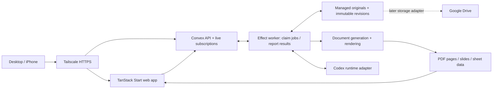

# HA Workspace — architecture proposal

Status: foundation in progress, updated September 8, 2026 (America/New_York). The private repository, verified local fake Drive, and shadcn/TanStack Start scaffold are established. The baseline Start build passed. Vite+ formatting, lint, type checks, frozen installation, and 25 tests pass. The modern shell and Effect Atom state are implemented. The final configured build awaits Doppler reauthentication; full runtime integration and document workflows remain subject to the acceptance gates below.

Based on the **HA Workflow App Wireframe** task (`01a07ea0-e62b-7351-9374-828b3122a949`) and its final local HTML prototype. Use the wireframe to understand the work: find a file, review it, request a correction, and inspect the next revision. The finished interface will use a modern visual system and clearer interaction design. Its exact layout, spacing, and motion are product decisions, guided by the workflow.

## Recommended direction

Build a personal, browser-based workspace using **shadcn + TanStack Start + Tailwind**, **Vite+**, **Convex**, and **Effect v4 RC with Confect v10 prerelease**. Use a small Bun workspace monorepo because the application needs both a browser/server app and a local document worker. Adopt a **hexagonal modular monolith organized by feature**: domain rules and Effect use cases at the center, with Convex, Bun, React, file tools, and the agent runtime connected through explicit adapters.

Hosting decision confirmed by the user on September 8, 2026: use the existing local Convex setup at `/home/akh/LocalServices/Convex`, alongside a local document worker, reached from desktop and iPhone through Tailscale. This local setup is the deployment target for the prototype.



Arrows show logical responsibilities. File bytes go through authenticated upload/download endpoints; Convex records hold references and hashes. The browser receives no filesystem paths or worker/admin credentials.

## Product boundaries

| Surface        | Required behavior                                                                                       |
| -------------- | ------------------------------------------------------------------------------------------------------- |
| Companies      | Company list → selected company → its files → shared preview workspace                                  |
| Reports        | Recent reports and counts by company; filters return reports only                                       |
| Invoices       | Invoice-only list and preview; payment status is explicit data, never inferred from a filename          |
| Templates      | Global and company/project templates, scope/default badges, file previews                               |
| File workspace | Version selector, preview, annotations, comments, context, change request, refreshed revision           |
| Agent panel    | Project AGENTS.md and skill list; Markdown preview, editing, revision comparison, save/apply states     |
| Intake         | Reuse known facts; ask one batch of missing material questions; preserve answers and scoped corrections |

The first version previews DOCX, XLSX, PDF, and PPTX. Legacy DOC/XLS/PPT require a separately tested conversion path. Office files remain downloadable originals. Browser annotations and structured field edits create document revisions; arbitrary Word/Excel/PowerPoint editing is a separate capability decision.

See `EFFECT_GUIDE.md` for the adopted dependency rules, Effect v4 coding standard, transaction invariants, and acceptance tests. The visual plan includes these requirements in its engineering notes.

## Verified stack and version policy

Registry values were checked directly during this planning session. These are candidate pins, not proof that the complete application compiles together. Bun 1.4.2 is the latest stable release verified on September 8, 2026. Bun 1.4.2 and Node 24.20.0 are now installed and pinned in the repository’s `mise.toml`. The other rows retain the researched compatibility baseline until the complete dependency/build checks are finished.

| Package/tool          | Candidate                      | Planning consequence                                                                  |
| --------------------- | ------------------------------ | ------------------------------------------------------------------------------------- |
| Bun                   | 1.4.2 stable                   | Workspace package manager and target runtime for the web server and Effect worker     |
| Node tooling          | 24.20.0, pinned in `mise.toml` | Vite+ and Confect toolchain compatibility; not the application worker runtime         |
| Vite+                 | 0.3.0                          | Unified dev/build/check/test and workspace task runner                                |
| TanStack Start        | 1.168.50                       | React routing and server shell; preserve scaffold-compatible Router/React versions    |
| shadcn CLI            | 4.21.0                         | Begin with its TanStack Start monorepo template                                       |
| Tailwind CSS          | 4.3.3                          | Shared semantic tokens in the UI package                                              |
| Convex                | 1.45.0                         | Satisfies the inspected Confect server peer requirement                               |
| Effect                | 4.0.0-rc.112                   | Explicit RC pin; `latest` still resolves to v3                                        |
| @effect/atom-react    | 4.0.0-rc.112                   | Effect-native UI state and commands; React 19 and scheduler >=0.25.0 <0.28.0 required |
| @effect/vitest        | 4.0.0-rc.112                   | Effect scopes and test services within Vite+ Vitest                                   |
| Confect packages      | 10.0.0-next.21                 | Explicit prerelease pins; stable v9 targets Effect v3                                 |
| @effect/platform-bun  | 4.0.0-rc.112                   | Bun services and worker entry point                                                   |
| @effect/platform-node | 4.0.0-rc.112                   | Confect server/CLI dependency and tooling boundary                                    |

Use scoped `@confect/*` packages; the unrelated bare `confect` npm package is not the framework. Pin all selected Confect packages to the same version. Use core/server/cli/js/test initially; the inspected React package is an alternative client, not an additional subscription layer. Registry metadata for the [Effect RC](https://registry.npmjs.org/effect/4.0.0-rc.112) and [Confect server prerelease](https://registry.npmjs.org/@confect/server/10.0.0-next.21) establishes this compatibility target. See `dependency-evidence.json` for the captured package metadata.

### Scaffold and tooling

Start from the official shadcn flow: `bunx shadcn@4.21.0 init -t start --monorepo`, choosing Bun, neutral colors, and one primitive base (proposed: Radix). Its monorepo starter currently includes Turborepo. Preserve the generated app/UI arrangement, then replace the generated task orchestration with Vite+ after a baseline build. [shadcn installation](https://ui.shadcn.com/docs/installation/tanstack), [monorepo guide](https://ui.shadcn.com/docs/monorepo).

Run Vite+ migration from the new repository root. Meet its Vite 8+/Vitest 4.1+ migration prerequisites first; inspect aliases and plugin compatibility rather than assuming the scaffold already meets them. Preserve TanStack Start, React, and Tailwind Vite plugins and their documented ordering. Vite+ migration also manages the Vite alias and matching Vitest version. [Migration](https://viteplus.dev/guide/migrate).

Use Oxlint and Oxfmt through `vp check`, with type-aware linting and type checking enabled. Use `vp test` for domain/backend tests and Playwright for the critical browser flow. Use `vp run` for workspace tasks and codegen ordering; avoid maintaining two task runners. Check any framework-specific ESLint rules for migration gaps before removal; retain narrowly scoped checks only if needed. [Static checks](https://viteplus.dev/guide/check), [task runner](https://viteplus.dev/guide/run).

### Bun and Vite+ have different jobs

Use **Bun 1.4.2 stable**, which includes the Rust rewrite introduced in Bun 1.4. This choice changes the JavaScript runtime and package manager; application code remains TypeScript. Bun’s 1.4.2 notes include an AsyncLocalStorage leak fix and long-running JIT/GC fixes, which are relevant to a persistent agent/document worker. Actual performance and reliability still need our workload tests. [Bun 1.4](https://bun.com/blog/bun-v1.4), [Bun 1.4.2](https://bun.com/blog/bun-v1.4.2).

Declare `"packageManager": "bun@1.4.2"`, use root `package.json` workspaces/catalogs and `workspace:*` internal dependencies, and commit one `bun.lock`. CI installs with a frozen lockfile. Once the generated starter is converted, remove its obsolete pnpm lock/config and Turbo scripts. Vite+ explicitly supports Bun package management and detects the package manager from the root declaration. [Bun workspaces](https://bun.com/docs/pm/workspaces), [Vite+ package management](https://viteplus.dev/guide/install).

| Responsibility                                         | Tool/runtime                                                                                 |
| ------------------------------------------------------ | -------------------------------------------------------------------------------------------- |
| Dependency installation                                | Bun, directly or through Vite+ forwarding                                                    |
| Lint, format, type checks, build, workspace task graph | Vite+                                                                                        |
| Main unit/integration tests                            | Vite+ Vitest with matching `@effect/vitest`; no duplicate suite in Bun’s test runner         |
| Worker process                                         | Bun + matching `@effect/platform-bun`                                                        |
| Production Start server                                | Bun, using the supported Start server adapter/build target verified in the first slice       |
| Vite+/Confect CLI and code generation                  | Compatible Node toolchain until explicit Bun execution passes a supported compatibility test |
| Convex queries/mutations                               | Convex’s own deterministic runtime                                                           |
| Convex Node actions, if needed                         | Runtime supplied by the local Convex backend; inspect its version separately                 |

Bun supports TanStack Start, but its example does not prove this complete Vite+/Confect monorepo works together. Run the production output on Bun, not just a successful development server. Vite+ manages Node separately; Bun package management does not switch every CLI’s execution runtime. Keep Node dependencies at that tooling boundary. [Bun Start guide](https://bun.com/guides/ecosystem/tanstack-start), [Vite+ environment](https://viteplus.dev/guide/env).

Start Bun worker code through the Effect Bun runtime entry point. Keep `Bun.*`, raw `fetch`, process spawning and filesystem APIs inside adapters; prefer Effect platform services there. Use Vite+ for the existing test/build responsibilities instead of adding a second runner or bundler. Pin stable Bun upgrades deliberately and re-run the runtime checks before changing the lockfile.

### Repository layout

```text
ha-workspace/
  apps/
    web/                    # shadcn TanStack Start app
      src/routes/
      src/features/         # companies, files, review, agent, intake
    worker/                 # Effect Bun service, render/agent child processes
  packages/
    ui/                     # generated shadcn components + HA shell + tokens
    domain/                 # Effect schemas, facts, pure policies, revision contracts
    application/            # Effect use cases and ports, grouped by feature
    backend/
      confect/tables/        # table definitions
      confect/*.spec.ts      # client-safe API contracts
      confect/*.impl.ts      # backend implementations
      confect/_generated/    # generated
      convex/               # Confect deploy output/config
    documents/              # format adapters and calls to retained render tools
  tests/e2e/
  docs/                     # architecture, design, decisions, operating notes
  package.json              # packageManager: bun@1.4.2, workspaces, catalogs
  bun.lock
  bunfig.toml
  vite.config.ts
```

The private repository is `https://github.com/alexmikeagent/ha-workspace`, checked out at `/home/akh/Projects/ha-workspace`. It sits outside the Google Drive sync tree. Keep source documents, databases, temporary renderer profiles, and job staging outside Git. The adjacent `/home/akh/Projects/ha-workspace-data` directory owns the prototype’s local Drive data.

Domain imports Effect and its own modules. Application imports domain and declares ports with Context.Service. Backend and runtime adapters implement those ports. The web and worker entry points compose Layers. Backend functions never import document renderers, and browser exports cannot reach server implementation code. Keep every workspace dependency explicit.

Confect expects sibling `confect/` and `convex/` directories and generates deployment files and client refs. Treat generated files as output; configure the backend workspace as the codegen/deployment working directory. Tests should use `.test.ts` so Confect API `.spec.ts` files are not mistaken for tests. [Confect v10 structure](https://confect.dev/v10/concepts/project-structure).

## Repository and configuration decisions

Work from `/home/akh/Projects/ha-workspace` with the private GitHub remote [alexmikeagent/ha-workspace](https://github.com/alexmikeagent/ha-workspace). Use small, coherent commits with a passing check at each meaningful boundary. Keep the main branch runnable; use focused branches for substantial feature work. Review the final diff, test behavior that can regress, and update operating notes when configuration or migrations change. Generated backend code and lockfiles follow one documented regeneration path. Private Drive documents and secret values are never repository fixtures.

All application environment values and secrets belong to the new **Doppler `ha-workspace` project**, in workplace **OmarchySys76**, using **`dev_personal`** for this local environment. Runtime commands receive configuration through `doppler run --no-fallback`; do not create app `.env` files or export secret-value snapshots. Repository files may declare variable names, validation schemas, and non-secret project/config references. Doppler CLI authentication is pending reauthentication; project creation is not evidence that CLI injection already works.

Load injected values with Effect `Config` at each composition root, use redacted secret values, and fail startup with a safe explanation if required configuration is missing. Map only intentionally public configuration to the browser. Deployment/admin keys, service tokens, local filesystem roots, and renderer credentials stay on server/worker boundaries. CI should use its own identity/config; personal CLI credentials must not be reused as CI secrets. Authenticate and test the runtime injection before starting app processes.

## Data and state ownership

Convex owns durable application state and transaction boundaries. Effect owns typed domain operations, dependency injection, error handling, cancellation, and worker orchestration. An Effect program is not by itself a durable queue.

Use Effect Atom as the UI state layer: `@effect/atom-react` with the v4 reactivity modules. One session-owned registry and `Atom.runtime` handle feature state, derived values, typed commands, and stream-backed reads. Use one scoped `@confect/js` WebSocket client for live queries and commands; an adapter preserves its schema codecs and typed query results. Do not add parallel Confect React subscriptions or a second query cache. [Effect React bindings](https://github.com/Effect-TS/effect/blob/effect%404.0.0-rc.112/packages/atom/react/README.md), [Confect JS client](https://confect.dev/v10/clients/js/websocket.md).

TanStack Router owns navigation and URL filters. Atoms own shared workspace state, panel preferences, draft editing, annotation selection, and command status; React handles local DOM details. Persist drafts through an Effect storage adapter, keyed by owner and immutable source revision. Start with an SSR shell and client-loaded authenticated atoms. Any later data hydration uses request-owned registries and an explicit serialization boundary. `EFFECT_GUIDE.md` defines the ownership and lifecycle checks.

| Tables                                | Purpose and key relationships                                                                             |
| ------------------------------------- | --------------------------------------------------------------------------------------------------------- |
| users, companies, projects            | Single owner initially; projects belong to a company                                                      |
| files                                 | Logical file; company/project, category, MIME type, latest ready revision                                 |
| fileVersions                          | Immutable bytes reference, parent, SHA-256, size, provenance and validation state                         |
| previews                              | Source version/hash, renderer version, page/slide/sheet manifest, status                                  |
| templates, templateBindings           | Versioned template and scope; bindings by task kind, company/project and effective dates                  |
| tasks, contextSnapshots               | Operation kind, structured facts with sources, missing fields, chosen input/template/instruction versions |
| comments                              | File version, anchor, message, status and linked revision request                                         |
| jobs, jobEvents                       | Durable work, attempt/lease, progress, cancellation and structured failure                                |
| instructionFiles, instructionVersions | AGENTS.md/skills source, hash, draft and active version                                                   |

Index lists by owner/company/category and date, file versions by file, comments by version, and jobs by state/lease. Paginate lists and event history. Store date-only visit dates separately from UTC event timestamps. Represent money in integer minor units and keep rate evidence scoped to the client.

Start with these API groups: `companies`, `files`, `templates`, `tasks`, `comments`, `jobs`, and `instructions`. File commands create an upload reservation, finalize a verified version, and return an authenticated preview/download reference. `tasks.prepare` reports missing fields; `tasks.start` records a context snapshot and enqueues work atomically. A revision request includes its base version and idempotency key.

## Document and review pipeline

1. Import or upload a source into managed storage. Verify extension/MIME, hash it, and record the selected company, project, and category.
2. Resolve the task operation: new completed document, intentionally incomplete draft, limited copy, or revision. Ask only the questions material to that operation.
3. Resolve an authorized template and effective client facts. Record source references and a frozen context snapshot.
4. Atomically create a queued job. The local worker claims it through an authenticated mutation using a lease and attempt/fencing token.
5. Work in a job-owned directory. Generate a uniquely named candidate using deterministic tools wrapped by Effect.
6. Run DOCX compatibility checks before rendering. Produce a preview manifest and perform the relevant content/layout verification.
7. Commit an immutable ready revision and its preview together at the metadata boundary. Failed or stale attempts cannot replace the visible version.
8. Realtime updates refresh the preview while retaining the user's navigation, comments, and composer draft. Publication creates a new final filename under the applicable workflow policy.

Use heartbeats, lease expiry, bounded retries for transient failures, and explicit cancel requests. Recheck cancellation, base revision, running state, lease expiry, and fencing token before commit. Scope idempotency keys by owner and operation and bind them to a canonical request fingerprint; a reused key with changed payload is a typed conflict.

Render attempts only stage bytes and commit ready revisions. A separate publication command freezes an already committed revision ID/hash, canonical new destination, and operation ID. Publish with exclusive creation and no replacement, rechecking Word locks. A replay accepts an existing matching hash; conflicting bytes produce `PublicationConflict`. This supports recovery after a file write without allowing a stale render attempt to publish its candidate. Operations must tolerate repeated attempts.

Convex queries/mutations stay deterministic and do no filesystem/process I/O. Even self-hosted Convex has its own function runtime; its functions do not run in the document worker’s Bun process. Conversion and long-running agent sessions run in the worker. [Convex runtimes](https://docs.convex.dev/functions/runtimes).

### Preview contract

| Format   | First implementation                                                                                         | Annotation anchor                                                         |
| -------- | ------------------------------------------------------------------------------------------------------------ | ------------------------------------------------------------------------- |
| DOCX     | Local office conversion to PDF/pages; retain original DOCX                                                   | Version + page + normalized rectangle; optional stable template field key |
| PDF      | PDF.js viewer with text layer and page virtualization                                                        | Version + page + rectangle/text quote                                     |
| PPTX     | Render slides locally; thumbnails and slide navigation                                                       | Version + slide identifier/index + normalized rectangle                   |
| XLSX     | Read-only sheet grid with formatted values and bounded range loading; separate print preview where available | Version + sheet identity/name + cell/range                                |
| Markdown | CodeMirror editor and sanitized rendered preview                                                             | Version + line range/text context                                         |

PDF.js, CodeMirror, and sheet parsing/render libraries are proposed implementation candidates requiring a focused spike. Do not claim Office fidelity or spreadsheet recalculation before testing real samples. Spreadsheet previews distinguish cached values from recalculated values; macros/external links are never executed as part of viewing.

Cache derived previews by source hash, renderer/tool version, and render options. A box annotation is meaningful only for its original revision. When pagination changes, retain the old anchor and mark it for review unless a stable field mapping proves a new location. Never silently transfer a comment to a different paragraph.

### HA invariants to enforce in code

The existing project AGENTS.md supplies the authority: immutable general report/invoice templates, exact Dulles exceptions, same-client evidence for billing, namespace compatibility checks, Word owner-file locks, new filenames for publication, and job-directory ownership. Preserve template hashes in the database; a generic scope resolver cannot override an explicit exception. Conflicting or missing material authority becomes one targeted intake question.

Wrap the retained document tools before replacing them. On Windows use the specified safe renderer and its process-isolation behavior. Fail DOCX validation for undeclared Markup Compatibility namespaces. Rendering results do not authorize rewriting the source template to compensate for renderer differences.

## Agent integration and editable instructions

Add an `AgentRuntime` interface to the worker with start/resume, send correction, interrupt, and normalized event handling. Candidate implementation: Codex app-server over worker-owned stdio. Official documentation describes conversation, approval, authentication and streaming support; it also flags the app-server command/WebSocket transport as experimental. Treat integration as a prototype spike, pin its protocol version, and keep the adapter replaceable. [Codex app-server](https://learn.chatgpt.com/docs/app-server).

Map application tasks to runtime conversation IDs explicitly. Stream normalized progress into jobEvents in batches. Do not assume this app automatically inherits desktop task history or can call this session's desktop management tools. Model authentication is a later runtime setup step; planning needs no API key.

Give the agent a job directory and a frozen context bundle, with narrow tools for reading input versions, applying requested field changes, and creating a candidate revision. Deterministic file tools enforce publication rules regardless of agent prose.

The Agent panel lists the active project instructions and relevant skill versions. Editing auto-saves a draft; an explicit Apply action activates it. Compare the source hash before replacing an allowlisted instruction file, preserve a recoverable prior version, and show conflicts instead of overwriting another edit. An active run retains its instruction snapshot; changes apply to subsequent runs. Skill assets/scripts are linked as package dependencies so a SKILL.md preview is not misrepresented as the entire skill.

## Storage, access and deployment

The initial provider is a local fake Drive populated from the selected local mirror at `/home/akh/GoogleDrive`. Its verified copy contains **2,867 files totaling 1,275,661,520 bytes**, with 989 directories. SHA-256 verification established that the copied file contents match and the source remained unchanged during copying. This is evidence about the selected local mirror; a complete cloud Drive inventory has not been established. Existing failed-sync files and 11 `.lnk` shortcuts are preserved as opaque files. The copy is a baseline snapshot taken while verification finished at `2026-09-08T05:34:31Z`; another task may change the live mirror afterward. The local verification record is `/home/akh/Projects/ha-workspace-data/manifests/verification.json`; private file manifests remain outside the repository.

Keep one standalone copy: `/home/akh/Projects/ha-workspace-data/fake-drive` is the application's initial provider, as requested by the user. The adapter writes new revisions and publications only into the working provider's managed area. It must never delete, rename, or modify files in the original mirror. Resetting demo state is a separately invoked operation that creates a fresh working location; routine startup must not reset data. Content and sensitive file manifests stay outside Git. Keep the standalone copy outside Drive and never register it with FreeFileSync. Exclude `sync.ffs_lock`, `sync.ffs_db`, and `*.ffs_tmp` from catalog ingestion and active application use; retain their copied bytes inert in the snapshot. The prototype does not edit live sync configuration or participate in live synchronization.

Use stable application IDs for domain identity. The local provider maps them to validated relative paths under an allowlisted root and records hashes and import provenance. Reject path traversal and symlink escapes. Managed storage owns immutable originals/revisions; Convex owns their searchable metadata. Preserve source filenames and folder structure at import. A future cloud Drive adapter uses provider file IDs and revisions behind the same Effect ports, with explicit conflict detection and sync status. It requires a separate cloud inventory and connectivity check.

Use `/home/akh/LocalServices/Convex` as the existing local Convex service location. Its directory was confirmed to exist during the plan update; its configuration and running status have not yet been inspected. Before wiring the app, read the service's applicable instructions and configuration, identify its client/API and HTTP-action endpoints, and determine the intended application deployment and persistent volumes. Reuse the existing service configuration and keep application source code in its own repository. Do not initialize over existing service data or assume that its database is empty.

Local Convex and the local worker keep application metadata and file services on the host/tailnet. The host must remain awake for access and processing; upgrades, backups, and recovery are part of the local operating plan.

Convex supports self-hosting; Tailscale Serve supplies private HTTPS access. Expose the web app and Convex client API through tailnet endpoints with WebSocket support; configure generated file/action URLs for iPhone reachability. Keep deployment/dashboard ports private. Validate this in the first spike. [Convex self-hosting](https://docs.convex.dev/self-hosting), [Tailscale Serve](https://tailscale.com/docs/features/tailscale-serve).

Use app authentication in addition to tailnet access: proposed single-owner session with a Convex-compatible token, plus a separate worker service identity. Final issuer choice is part of the hosting spike. Every public function verifies identity and ownership; the browser never receives a deploy/admin key. If exchanging Tailscale identity headers for a session, accept those headers only behind the trusted local proxy and validate origin/CSRF protections. Private hosting does not make model-provider requests offline.

Use persistent local volumes outside Drive sync, backup metadata with referenced immutable files, and prove restore on a separate instance. Display worker offline, preview pending/failed, unsaved changes, and reconnecting states. Offline authoring and a full sync engine are deferred; retain local editor/composer drafts and use idempotent submissions after reconnection.

## Build sequence and acceptance gates

1. **Compatibility foundation:** inspect the existing local Convex setup at `/home/akh/LocalServices/Convex` and establish the app's deployment target without changing unrelated data. Scaffold shadcn Start, migrate to Vite+, add exact Effect/Confect pins, generate/deploy one table/query/mutation to the designated local deployment, and prove live updates in two browser sessions. Verify Atom query/command integration, one shared subscription, typed errors, reconnect, session cleanup, and React 19 peer compatibility. Confirm Bun 1.4.2, compatible Node tooling, local backend connectivity, auth, monorepo imports, lint/format/type checks, and a production Start server running on Bun. Run a Bun worker test that spawns and cancels a child process, handles large file streams, and shuts down cleanly. Validate codegen under the declared Node toolchain and confirm one exact Effect version across workspaces. Inspect one-copy dependency resolution. If Confect blocks progress, isolate the incompatibility in its adapter and report it. Any temporary vanilla Convex adapter must still execute shared Effect use cases and schema checks; it must not create a second Promise-based business layer or downgrade Effect.
2. **Modern workspace shell:** implement navigation, filtered lists, file route, resizable preview/Agent panels, semantic light/dark tokens and phone layout. The wireframe defines workflow coverage. Use the verified fake Drive for real filenames and representative documents. Apply the typography, progressive disclosure, and restrained motion contract in `DESIGN.md`; test keyboard/touch flows and reduced motion.
3. **Real preview loop:** index the fake Drive and import representative DOCX, PDF, XLSX, PPTX; select a file, preview it, attach a versioned comment, refresh/reopen, and confirm persistence. Prove private file access from iPhone.
4. **One complete HA workflow:** resolve a report template, collect only missing facts, generate/verify/preview, apply an observation correction, and publish a new revision. Test the general and Dulles template rules, stale revisions, locks, failed rendering, worker restart and duplicate submissions.
5. **Agent and instruction editing:** integrate the runtime adapter, context/progress display, Markdown drafts, hash-conflict handling and active instruction versions. Demonstrate that an edit changes the next run while preserving the current run's snapshot.
6. **Expand:** invoice generation and client terms, richer sheet/slide changes, a separately verified cloud Drive adapter, backups/restore and operational polish.

The first meaningful deliverable is a persistent **company → file → preview → comment → revised preview** slice, inside the modern workspace shell. All four file formats receive basic preview coverage before deep editing expands.

Open choices: the owner authentication issuer, live local Convex deployment configuration, and whether future Office support includes full in-browser editing. The code location, private GitHub repository, local fake Drive, Doppler project, and local Convex service directory are settled. See `DESIGN.md` for the interface contract and `SETUP.md` for setup status.
